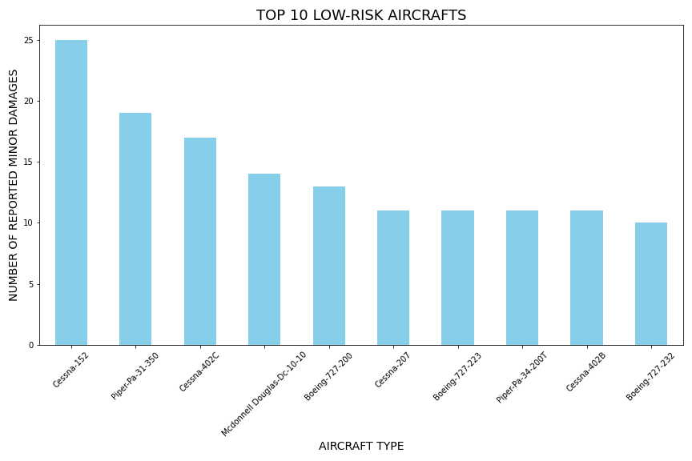
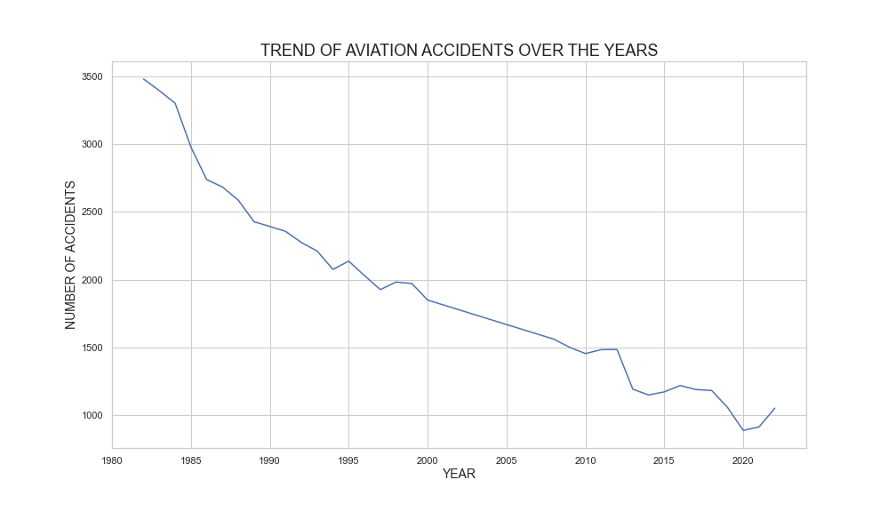
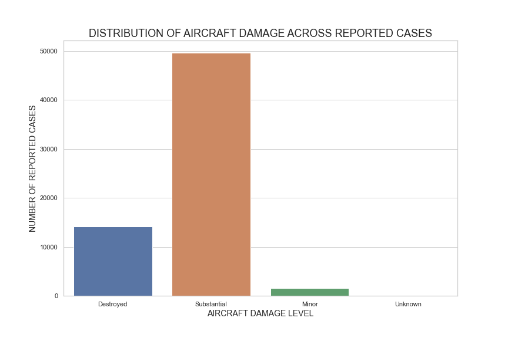

# AIRCRAFT RISKS ANALYSIS PROJECT

## Overview
This project identifies and analyzes critical risk factors within the aviation industry to support stakeholders in making informed decisions before entering the market. The insights derived from this project will guide the business in minimizing risks, ensuring 
safety, and selecting the most reliable aircraft for future operations, ultimately helping the company venture confidently into the aviation sector.

## Business Problem
The company is interested in purchasing and operating airplanes for commercial and private enterprises, but does not know anything about the potential risks of aircraft. This project will help decision-makers determine which aircraft are the lowest risk for the company to start this new business endeavor. 

## Key Business Questions
This project extracts insights from the data and answers the following key questions with visualizations;
- Which aircraft are the lowest risk for the company to start this new business endevor?
- What is the trend of aviation accidents over time?
- Which aircrafts have the highest number of recorded accidents/incidents?
- How do weather conditions affect the number of accidents and incidents?
- Which purpose of flight (e.g., commercial, private) has the most incidents?
- How bad are the damages in aircrafts after accidents/incidents?

## Data Understanding & Analysis
This analysis makes use of the [Aviation Accident Database & Synopses](https://www.kaggle.com/datasets/khsamaha/aviation-accident-database-synopses) data from the National Transportation Safety Board that includes aviation accident data from 1962 to 2023 about civil aviation accidents and selected incidents in the United States, its territories and possessions, and international waters. The project worked with the AviationData csv, as it better suits our analysis of finding the lowest risk aircraft for the company.
The csv file contains over 30 columns, however, I filtered through them to use only the most relevant columns to our analysis.
Inspection on the dataset's structure, summary statistics, cleanliness, and dimensionality is also done to ensure proper visualizations. 

## Key Findings
1. Cessna, Piper, and Boeing are some of the most common low-risk aircraft.

2. There has been a steady decrease in aviation accidents over the years

3. Most aircraft end up with substantial damages after an accident/incident

- The Jupyter Notebook contains these visualizations among others together with the insights stakeholders can deduce. Also, these diagrams are clearer in the notebook so I highly suggest opening it. 

A [Tableau Dashboard](https://public.tableau.com/app/profile/calmar.isoe2841/viz/AircraftRisksAnalysisDashboard/AircraftRisksAnalysisDashboard?publish=yes) with a summary of some of our key findings is also included in this analysis.

## Conclusion
This analysis reveals the risks involved in the aviation industry. The most accident-prone aircraft models, the trend of aviation accidents, the role of weather conditions, and the damage level experienced have all been explored in detail. 
This analysis leads to three main recommendations; 
- Consider purchasing and operating low-risk aircraft models, as they have consistently lower accident rates. This approach will not only minimize operational risks but will also enhance the company’s reputation for safety.
- Take advantage of the downward trend in aviation accidents. With the steady decline in aviation accidents over the years, you can capitalize on this during marketing to attract investors as well as customers.
- Invest in aircraft suitable for flight purposes with a low-risk profile. Cautiously evaluate whether to enter a specific segment before purchasing aircraft suitable for that sector. For instance, sectors like ferry, aerial observation, and public flying record lower incident rates and may be a safer and more favorable investment opportunity.

## Next Steps
- To conduct a deeper analysis on the root causes behind accidents and incidents in certain aircraft make and models. Explore further to determine which manufacturers produce the most incident-prone models, to aid in informed procurement decisions.
- To conduct further analysis to understand frequency vs. risk, especially for models like Cessna which appear in both low-risk aircrafts and in aircrafts with the most recorderd cases. 
Find out and prove if this paradox is indeed simply because these models are flown more frequently compared to other models and not due to inherent safety flaws
